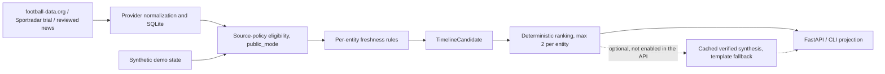

# Sports Briefing

A continuously updated personal sports timeline for Houston Texans, Arsenal, and Scottie Scheffler. It answers: **What is the most important thing I should know about this team or player right now?**

Meaningful, source-backed changes take priority over volume. A followed entity can disappear from home when nothing meaningful has happened.

## Project goals & engineering principles

Sports Briefing is a real personal product, deliberately built to portfolio-grade engineering standards. The aim is to demonstrate sound engineering judgment, not a list of technologies, and it is not tailored to any one employer or role.

- **Smallest defensible design.** Every architectural or technology choice has to be justified by a product need, and its tradeoffs have to be explainable. Complexity added only to show off a tool is treated as a defect.
- **Deterministic core.** Structured providers and explicit domain rules decide facts, freshness and ranking. Generated language is optional and always has a template fallback.
- **Evidence and provenance first.** Every item traces to its source and observation time. Source permissions are checked before data is stored or sent anywhere.
- **Degrade, don't break.** One provider's failure or a missing model must not take down other entities' items.
- **Offline, reproducible tests** with synthetic fixtures. Each milestone records what is verified live and what is still open.

## Status

Milestone 1 is complete and live-verified: a **Python/SQLite Arsenal fixture/result pipeline** and deterministic CLI briefing. Milestone 2 adds a local FastAPI read endpoint and a minimal SwiftUI iPhone screen; see its [setup and verification](docs/milestone-2.md). Arsenal coverage supports only Premier League and UEFA Champions League. FA Cup, EFL Cup, other Arsenal competitions, Arsenal injuries and current news/reporter feeds remain unsupported; M6 has a separate archival news proof.

Milestone 3 adds a separate Texans schedule and practice/status-change pipeline on a Sportradar NFL evaluation trial. The authenticated schedule and injury shapes are verified; current-week acceptance stays open, and trial data may not be displayed publicly. See [M3 setup and limitations](docs/milestone-3.md). The iPhone app remains Arsenal-only.

Milestone 4 adds a deterministic, read-only Arsenal + Texans home timeline with explicit cross-sport precedence, sparse per-entity selection, explainable reasons, and CLI/HTTP output. M4 is offline-complete; it does not close M3's separate authenticated current-week persistence/idempotency gate. See [M4 behavior and ranking rules](docs/milestone-4.md).

Milestone 5 adds bounded Scottie Scheffler PGA stroke-play ingestion on a Sportradar Golf evaluation trial, conservative tee-time candidates, and product-observed recent-result eligibility after a known finalization transition. Authenticated ingestion, persisted readback, and unchanged rerun are verified; Scottie-specific live-state evidence remains open. See [M5 setup and evidence](docs/milestone-5.md).

Milestone 6's source-independent implementation is complete; its current-news acceptance is blocked on external source access and does not block M7. The offline Texans evidence proof groups reviewed publications into developments. P2/P3 add a bounded licensed Wikinews archival retrieval proof for two Arsenal reports about the same signing, with normalization pinned to reviewed source content. Historical, date-only evidence remains quiet on home. Real grouping is supported by a pinned archival pair; qualifying current news-candidate acceptance remains open; official Texans retrieval permission is unresolved. See [M6 evidence and source limits](docs/milestone-6.md).

Milestone 7 (slices 1–3, awaiting review) adds the evaluation infrastructure for optional summary prose after deterministic ranking: a spoiler-aware evidence boundary, a deterministic verifier, a cache keyed by evidence, prompt and model, a versioned prompt contract, and an offline evaluation set with known verifier blind spots. It is not a production model integration: no LLM provider is integrated, the API does not enable synthesis, and the timeline uses its templates. See [M7 synthesis boundary and evaluation](docs/milestone-7.md).

## Architecture

One Python application with SQLite; no services, queues or agents.



Structured provider data and deterministic rules decide facts, freshness, eligibility and order. A model may only rephrase an already-selected item and is never required. [Decisions](docs/decisions.md) records the original, broader architecture proposal; the [roadmap](docs/agents/issue-tracker.md) holds current milestone state.

## Public/demo status

Provider integrations are implemented and tested locally. Public deployment uses only sources with confirmed redistribution rights; restricted/evaluation-only sources are represented with explicitly labelled synthetic demo data. Nothing is deployed, and no source is currently cleared for public display of timeline items (see the [rights matrix](docs/feasibility.md#public-deployment-rights-checked-2026-09-27)).

Public mode is an explicit server setting, never a client parameter: `SPORTS_BRIEFING_PUBLIC_MODE=true` (unset or `false` keeps local development behavior; any other value fails startup). Source-rights eligibility is applied when candidates are loaded, before the unchanged ranking and two-per-entity cap. In public mode:

- **Arsenal** shows no items and is listed in `unavailable_entities`, because football-data.org public display is unresolved. `/briefings/arsenal` returns 404.
- **Texans and Scottie** never read Sportradar data. They show synthetic demo candidates generated in code relative to the evaluation day and passed through the existing freshness rules. `/briefings/texans` returns 404. Synthetic Texans news evidence is kept; reviewed Texans news is dropped.
- **Wikinews** has no timeline candidate path today, so it contributes nothing. A future Wikinews candidate would need an explicit public-mode allowance with its attribution.
- `ingest texans` and `ingest scheffler` fail before any request. The provider code stays for local use.
- `GET /meta` reports `public_mode`, the API version and each entity's source (`provider`, `demo` or `unavailable`).

Every demo item carries `data_mode: "demo"`, source provider `synthetic-demo`, an attribution that states it is synthetic, a title ending in "(demo)" and a summary starting "Demo data:". Ranking never reads `data_mode`. A client that shows timeline items must render a visible "Demo data" label for such items and must not describe them as live, current or latest. The iPhone app remains Arsenal-only and reads `/briefings/arsenal`, so in public mode it shows its existing "no briefing" state.

No database seeding command exists: demo data never touches SQLite, so it cannot collide with provider rows and nothing is seeded at startup.

## Run locally

Requires Python 3.11+. No credentials are needed for the tests or the public-mode demo path.

```sh
python3 -m venv .venv
.venv/bin/python -m pip install -r requirements-dev.txt
.venv/bin/python -m unittest discover -s tests            # offline, temporary SQLite files
SPORTS_BRIEFING_PUBLIC_MODE=true .venv/bin/python -m sports_briefing timeline
SPORTS_BRIEFING_PUBLIC_MODE=true .venv/bin/python -m uvicorn sports_briefing.api:app --host 127.0.0.1 --port 8000
```

Then open `http://127.0.0.1:8000/timeline` or `/meta`. SQLite schema is created on first ingestion under `data/` (git-ignored); the timeline reports entities without stored data as unavailable, so no database file is required.

Provider ingestion is optional and local-only. Copy `.env.example` to `.env` (git-ignored), export the variables, and run, for example, `python -m sports_briefing ingest arsenal` followed by `python -m sports_briefing timeline` without public mode. See [M1](docs/milestone-1.md) for credential handling and data limits. Use `briefing --hide-results` or the timeline default for spoiler-safe output.

"Public-ready" here means the repository can be cloned, understood, and tested without private context or credentials. It does not mean deployed, fully licensed or feature-complete; see the [public-ready checklist](docs/agents/issue-tracker.md#public-ready-checklist).

## Read next

- [Product specification](docs/product-spec.md): agreed scope, behavior, and exclusions
- [Feasibility](docs/feasibility.md): dated source research, licensing and coverage gaps
- [Decisions and proposed architecture](docs/decisions.md): trade-offs, domain boundaries, first milestone
- [Milestone 1 setup](docs/milestone-1.md): commands, schema, failure behavior and verification
- [Milestone 2 setup](docs/milestone-2.md): local API, iPhone client, contract and limitations
- [Milestone 3 setup](docs/milestone-3.md): Texans ingestion, change history and provider-verification gate
- [Milestone 4 setup](docs/milestone-4.md): cross-sport candidates, ranking, timeline CLI/API and limits
- [Milestone 5 setup](docs/milestone-5.md): Scottie Golf ingestion, source clocks, tee-time and observed-result candidates, and the remaining LIVE gate
- [Milestone 6 development evidence](docs/milestone-6.md): Texans reviewed import, Wikinews archival proof, provenance, freshness, and remaining acceptance
- [Milestone 7 synthesis](docs/milestone-7.md): bounded summary synthesis, verifier, cache identity, prompt contract and evaluation workflow

This is a separate repository from FullCourt. No FullCourt code is copied.

The canonical current roadmap is [docs/agents/issue-tracker.md](docs/agents/issue-tracker.md); detailed historical records also exist under `.scratch/`. No external tracker is configured.
