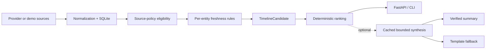

# Sports Briefing

Sports Briefing is a personal sports timeline for three teams and players I follow:

- **Arsenal** — Premier League / Champions League
- **Houston Texans** — NFL
- **Scottie Scheffler** — PGA golf

It answers one question:

> **What is the most important thing I should know about this team or player right now?**

Instead of behaving like a general sports feed, Sports Briefing surfaces at most two items per entity. A quiet entity can show nothing. Results are hidden by default so the timeline is spoiler-safe.

The project is a real personal product built to portfolio-grade engineering standards. The goal is to make engineering decisions that are small, explicit, testable, and defensible rather than adding technology for its own sake.

## How it works



Timeline ranking is deterministic:

`LIVE > IMMINENT > MEANINGFUL_CHANGE > RECENT_RESULT > ROUTINE`

Ties are resolved deterministically, and the timeline is capped at two items per entity.

A few design principles guide the project:

- **Deterministic core.** Providers and explicit rules decide facts, freshness, eligibility, and ranking.
- **Sparse by design.** The product is not trying to fill every slot with content.
- **Spoiler-safe by default.** Results are only exposed when explicitly requested.
- **Provenance first.** Timeline items retain source attribution and observation metadata.
- **Rights-aware source policy.** Data is excluded from public output when public-use rights are blocked or unresolved.
- **Graceful AI boundary.** Optional LLM synthesis may only rewrite an already-selected summary. It cannot rank, select, or establish facts, and the deterministic template remains the fallback.
- **Offline reproducibility.** The test suite uses synthetic fixtures and temporary SQLite databases; credentials and provider network access are not required.

## Data sources and public demo

The repository contains integrations for all three followed entities, but public-use rights differ by source.

### Arsenal

The Arsenal integration uses **football-data.org** for fixtures and results.

The integration works locally, but public display and caching rights are still awaiting provider confirmation. In public mode, Arsenal is therefore reported as **unavailable** rather than exposing unresolved provider data.

### Houston Texans

The Texans integration was built and validated against Sportradar's NFL evaluation APIs for schedule and availability data.

Sportradar trial data cannot be published publicly, so public mode uses clearly labelled synthetic Texans demo items instead.

### Scottie Scheffler

The golf integration was built and validated against Sportradar's PGA Golf evaluation APIs.

For the same rights reason, public mode uses synthetic Scottie demo data rather than trial data.

### News

The news layer stores reviewed normalized facts and provenance (source, URL, title, publication and observation times) rather than full article text. It can group several documents into one underlying development.

The architecture has been exercised with synthetic evidence and licensed archival Wikinews material. There is not yet a licensed current-news source for the public product.

### Demo data

Demo timeline items are machine-readable:

```json
{
  "data_mode": "demo"
}
```

They are also visibly labelled in their title, summary, provider, and attribution. A client that displays them should show a visible "Demo data" label.

Demo data is generated in code and passed through the same freshness and ranking rules as provider-backed candidates. It is never written to SQLite.

## Public mode

Public-safe behavior is enabled server-side:

```bash
SPORTS_BRIEFING_PUBLIC_MODE=true
```

In public mode:

- unresolved or restricted provider data is filtered **before ranking**;
- Arsenal is marked unavailable;
- Texans and Scottie use labelled demo items;
- Sportradar ingestion is disabled;
- `GET /meta` reports whether each entity is using a provider, demo data, or is unavailable.

Clients cannot change this setting.

## Optional LLM synthesis

The repository contains the evaluation infrastructure for bounded LLM-generated summaries, but **no real model is integrated or enabled in the API**.

The synthesis boundary includes:

- spoiler-aware structured evidence;
- evidence IDs for generated claims;
- a versioned prompt contract;
- deterministic output verification;
- cached summaries;
- template fallback;
- an offline evaluation set of 24 cases.

The LLM boundary sits after deterministic selection and ranking. It cannot decide what happened, what is relevant, or which item appears.

Real-model evaluation and human review are intentionally still pending.

## Tech stack

- **Python 3.11**
- **FastAPI + Uvicorn**
- **SQLite** using the Python standard library
- **SwiftUI** proof-of-concept iPhone client for the Arsenal briefing
- **unittest**
- **GitHub Actions**

The backend intentionally remains a single Python application rather than introducing queues, microservices, or additional infrastructure without a product need.

## Quick start

No provider credentials are required to run the public-safe path or the test suite.

```bash
python3 -m venv .venv
.venv/bin/python -m pip install -r requirements-dev.txt

.venv/bin/python -m unittest discover -s tests

SPORTS_BRIEFING_PUBLIC_MODE=true \
  .venv/bin/python -m sports_briefing timeline

SPORTS_BRIEFING_PUBLIC_MODE=true \
  .venv/bin/python -m uvicorn sports_briefing.api:app \
  --host 127.0.0.1 \
  --port 8000
```

Then open:

- `http://127.0.0.1:8000/timeline`
- `http://127.0.0.1:8000/meta`
- `http://127.0.0.1:8000/docs`

Provider ingestion is optional and local-only. Optional credential names are documented in `.env.example`.

## API

| Endpoint | Purpose |
| --- | --- |
| `GET /health` | Service health |
| `GET /meta` | Public mode and source status for each entity |
| `GET /timeline` | Ranked multi-entity timeline |
| `GET /briefings/arsenal` | Arsenal briefing |
| `GET /briefings/texans` | Texans briefing |

`/timeline` hides results unless called with `hide_results=false`. It also accepts an optional timezone-aware `as_of` timestamp to evaluate the timeline at a specific time; it defaults to the current time.

`/briefings/arsenal` also hides results by default. In public mode, both briefing endpoints return `404`, because they would expose provider data that is not cleared for public display.

## Testing

The repository currently has **198 offline tests**.

```bash
.venv/bin/python -m unittest discover -s tests
.venv/bin/python -m compileall -q sports_briefing tests
git diff --check
```

The fixtures used for NFL and golf tests are independently authored synthetic payloads rather than captured provider responses.

GitHub Actions runs the same core checks on `main` without provider credentials.

## Project status

Built today:

- Arsenal, Texans, and Scottie domain integrations
- deterministic multi-entity timeline and ranking
- spoiler-safe result handling
- provenance-aware news evidence layer
- public-mode source gating and demo data
- FastAPI and CLI interfaces
- SwiftUI Arsenal proof of concept
- bounded LLM synthesis evaluation infrastructure
- offline CI and synthetic provider fixtures

Intentionally not complete yet:

- no hosted deployment or live demo URL (a single-host deployment package and runbook are prepared in [`deploy/`](deploy/README.md))
- no public provider-backed Texans or Scottie data
- football-data.org public-use confirmation is still pending
- no production LLM integration

For detailed milestone state, blockers, and future work, see [`docs/agents/issue-tracker.md`](docs/agents/issue-tracker.md).

## Documentation

- [`docs/product-spec.md`](docs/product-spec.md) — product scope and behavior
- [`docs/decisions.md`](docs/decisions.md) — architecture and engineering decisions
- [`docs/feasibility.md`](docs/feasibility.md) — provider feasibility, licensing research, and the public-deployment rights matrix
- [`docs/milestone-1.md`](docs/milestone-1.md) through [`docs/milestone-7.md`](docs/milestone-7.md) — detailed milestone records and verification
- [`docs/agents/issue-tracker.md`](docs/agents/issue-tracker.md) — current roadmap, blockers, milestone state, and readiness checklists

## License

The source code in this repository is licensed under the [MIT License](LICENSE).

Third-party sports data remains subject to the terms of its respective provider and is **not** relicensed by this project.
