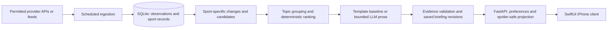

# Decisions and architecture proposal

Recorded 2026-09-20. Product decisions in [product-spec.md](product-spec.md) are accepted inputs. The user subsequently authorized Milestone 1: Python/SQLite Arsenal fixture ingestion and a deterministic CLI briefing, limited to PL/CL. The broader architecture below remains a proposal; it is not authorization for a server, client or infrastructure. Milestone scope/evidence is tracked [locally](../.scratch/milestone-1/spec.md).

## Decision register

| Status | Decision | Reason / trade-off |
| --- | --- | --- |
| Accepted | Separate sports-briefing repository; Texans, Arsenal, Scheffler only | Test three genuinely different rhythms without expanding sports coverage. |
| Accepted | Continuous, sparse timeline; explicit preferences; source-backed topics | Relevance is more valuable than filling home. No morning-only cadence. |
| Accepted | iPhone first; language direction EN/KO; spoilers configurable | Content remains reusable without building other clients. |
| Proposed | Private, single-user first milestone | Prove data and briefing behavior before account systems or public distribution; does not waive provider terms. |
| Proposed | Python + FastAPI, SQLite, one process/instance initially | Enough for three entities and one ingestion writer, with fewer services to operate. |
| Proposed | Deterministic change detection/ranking and text templates first | Establish an explainable baseline before measuring whether LLM prose improves it. |
| Proposed | Bounded LLM extraction/summary/translation after baseline | Adds useful API experience only for evidence we may process; never invents scores/status. |
| Proposed | Exclude X from initial integration | Monitoring is possible; content handling and LLM permission are a separate gate. |
| Unresolved | Provider contracts, budget, exact competition/injury coverage, deployment | See [feasibility.md](feasibility.md); no subscriptions or account creation authorized by this proposal. |

## Smallest architecture

These are modules in one Python application, not services or agents. Provider requests run server-side; no data-provider or LLM secrets ship to the phone. The client requests cached briefings, refreshes when active, and offers intentional reveal. No sockets are required initially. Continuously updated means a scheduled backend and foreground refresh, not guaranteed second-by-second delivery or continuous iOS background execution.

**Proposed runtime:** one Docker image, one FastAPI process, one supervised scheduler task started with application lifecycle, one persistent local SQLite volume. Prevent overlapping ingestion runs; use bounded async I/O and short serialized writes. Persist job cursor/last success so restart catches up idempotently. Never hold a transaction open during a provider or LLM call. No multi-worker startup that accidentally duplicates the scheduler. If the scheduler stalls, surface unhealthy status rather than returning a misleading healthy service.

Local CLI ingestion comes before the server. Only introduce a separate worker when actual duration/reliability evidence warrants it. Move to PostgreSQL when multiple hosts/writers, managed-database recovery, or a chosen hosting topology demands it; do not share a SQLite file across remote machines. [SQLite guidance](https://www.sqlite.org/whentouse.html) supports server-side use with low write concurrency; [FastAPI deployment guidance](https://fastapi.tiangolo.com/deployment/concepts/) describes process/replication concerns.

| Approach | Complexity, reliability and operations | Cost / learning / extension |
| --- | --- | --- |
| iPhone-only fetching | Few backend components, but exposed credentials, repeated fetching and no reliable shared ingestion while app is closed | Lowest hosting cost; weak fit for persistent change history and backend learning. Reject. |
| Python + SQLite, single instance | Short transactions, backups, restart recovery and persistent disk required; coupled uptime | Smallest fit; exercises SQL, ingestion and operations. Recommended for private pilot. |
| Python + managed PostgreSQL | Another service, credentials and network failures; easier independent processes and hosted backups | Higher baseline cost; adopt when hosting/scale warrants it, not for a resume keyword. |
| GitHub Actions as ingestion runtime | Fine for low-frequency batches; schedules can be delayed/dropped | Useful CI experience, unsuitable as the live clock. [GitHub documentation](https://docs.github.com/en/actions/reference/workflows-and-actions/events-that-trigger-workflows#schedule). |
| Queues, agents, vector database | More failure modes and infrastructure without current need | No demonstrated benefit. Excluded. |

Deployment platform and price remain undecided. A persistent single-instance host is the first topology to price; if its storage/backup limits make SQLite awkward, reconsider managed PostgreSQL before deployment. GitHub Actions later runs checks/builds and controlled delivery. Structured logs should include run/source/entity IDs, latency, records accepted/rejected, change count, last success and failure type, with credentials redacted. Operator health alerts are distinct from excluded user sports notifications.

## Domain boundaries

Shared concepts must represent genuinely shared meaning:

- **Followed entity:** canonical ID, team/player kind, sport, provider-ID mappings. Three curated entries initially; no broad search catalogue.
- **Source observation:** source identity/type, original ID/URL, published/effective/observed/fetched times where known, coverage/completeness, allowed retention and attribution. Store payloads only when permitted; otherwise permitted facts/IDs and provenance. Publication time is not fetch time.
- **Claim:** the fact or report used in a briefing, its supporting observation(s), and OFFICIAL / REPORTED / INTERPRETATION status. A licensed data vendor is not automatically an official league statement.
- **Briefing candidate:** followed entity, topic key, category, optional sport-specific event reference, supported claims, validity/expiry, importance band, urgency and explicit reason code.
- **Briefing revision:** stable topic identity, version, evidence IDs, language, generated/template text, publication/freshness state and spoiler-sensitive fields. Corrections update the topic rather than creating duplicate news.
- **Preferences:** category switches, language, sport-level spoiler default and entity override; per-event intentional reveals. First pilot can keep preferences/reveal state on the phone and send them with read requests. No behavioral inference.

These are conceptual records, not a mandate for six tables or a generic claim graph. Start with typed records and the few tables required by the first slice.

| Sport module | Keep local |
| --- | --- |
| NFL | Game; opponent/venue/kickoff; practice participation observations; roster status; game designation; inactive list; result; game-relative phase |
| Football | Fixture with competition/season/round; match clock/status/result; lineup confirmation; player availability |
| Golf | Tournament edition and course identity; player entry/commitment; tee times; round; leaderboard observation; player finish (including missed cut, withdrawal and ties) |

Do not subclass a universal Event into everything. A small tagged event reference gives briefings enough context without pretending a golf round is an NFL game. Each sport module emits the same small candidate shape; its underlying records can differ and initially duplicate a little code. An annual tournament brand, a particular year's edition and a course are different identifiers: historical performance must say which one is being compared. A tour schedule alone cannot establish Scheffler's next confirmed appearance.

## State, grouping and ranking proposal

Start with pure game-relative rule functions, not a state-machine library. Derive the current phase from authoritative event status/time and available reports. Handle byes, delays, suspensions, postponements, cancellations and corrections explicitly; time passing cannot manufacture a result or participation report. Football has fixture-based rules; golf uses entry/tournament/round state.

Pipeline order:

1. Validate source coverage and freshness, compare normalized snapshots, and detect meaningful changes. Repeated identical injury reports create no new change. Preserve old facts when a partial response omits them; a complete response's explicit correction can supersede them.
2. Apply explicit category and spoiler preferences **before eligibility and selection**. For a hidden event, substitute an outcome-independent event-state candidate; presence, item count, ordering and expiry must not depend on who won or how dramatic the result was. For revealed content, apply significance rules. NFL major-player importance starts from a small documented curated list or verified starter/depth-chart information. Opponent news requires a current matchup link.
3. Group compatible claims by entity + event + topic; retain disagreement and original provenance. Start with deterministic keys. Add LLM grouping only when example failures justify it.
4. Assign readable bands: live, imminent, changed, recent major result, routine. Use urgency, supported significance, effective time and stable ID as deterministic tie-breakers. Choose thresholds from reviewed examples, not arbitrary universal weights.
5. Select one item per entity, allowing a second only for a distinct important topic; suppress expired/routine filler. Cap across the three entities follows naturally at six, not a target to fill.
6. Build spoiler-safe text/media projections before returning content, retaining the outcome-independent selection from step 2. A reveal applies to a specific event, including its linked postgame topics, not permanently to the sport.

Tests later must cover result leaks through generated text, stats, thumbnails, accessibility labels, source titles, URLs shown as text, and deep links. Paired win/loss examples at identical times must produce identical hidden-mode item presence/count/order/expiry until reveal. Suppress unsafe previews; link to original sources with explicit spoiler context. Freshness and coverage failures must remain visible, so “no meaningful updates” never means “we failed to check”.

## Reliability and LLM boundary

Keep last-known-good data per entity/source with truthful freshness. A stale live snapshot becomes “last checked live”, not a confident current live state. Poll faster around events only within provider entitlements and budgets; separate polling interval from provider latency. Start proposed live refresh around 60 seconds and routine refresh around 15–60 minutes, then validate quotas and observed lag before promising an experience.

Set timeouts, bounded retries/backoff, quota-aware schedules and no overlapping runs. Treat 401/403 as access/entitlement failures, 429 as quota state, timeout/5xx as transient, malformed payloads as rejected observations, and valid empty results as distinct from outages. Provider corrections and LLM errors must not erase other entities' successful briefings. Persist a consistent new revision only after validation; recovery must work after process restart.

LLMs receive only permitted, bounded source evidence and a strict output schema. Untrusted source text is data, never instructions or tool authority. Require evidence IDs for claims, preserve reported qualifiers, verify deterministic fields, and fall back to templates or withhold unsupported prose. Cache by evidence revision + prompt/model version + language; do not regenerate every poll. Scores/status do not wait for a model. A bilingual factual template is a baseline, not proof that generated translation is accurate. Model/provider choice, retention settings and price are later decisions.

## FullCourt lessons inspected locally

Read-only inspection of `/Users/michaelju/Workspace/Projects/fullcourt` confirmed useful patterns; no code was copied and no FullCourt tests were rerun:

- `scripts/schedule_upsert_contract.py`: field-specific source ownership and preservation of known values across weaker updates.
- `scripts/fetch_nba_schedule_cdn.py`: provider-shaped records normalized before persistence; explicit time-zone conversion.
- `scripts/fetch_schedule.py`: canonical aliases, ID-based joins and incomplete-pair logging.
- `scripts/daily_update.py`: ordered ingestion dependencies and differing fatal/degradable failures.
- `src/lib/daily-refresh.ts`: per-game replacement preserves last-known-good rows on failure.
- `src/lib/api-route.ts`: data-specific cache windows. Reuse the principle, not FullCourt's NBA-specific timings or schema.

These support separating observed facts, deterministic calculations and interpreted prose. They do not establish that this new product's providers or permissions work.

## First coding milestone, authorized scope

**One local Arsenal fixture/result ingestion slice with persistence and a deterministic briefing.** The user approved this bounded implementation after the initial proposal. It covers only Premier League and Champions League, not complete Arsenal or three-entity V1 coverage.

The CLI uses the user's football-data.org credential and preserves provenance; it does not promise live data. Deterministic tests use synthetic provider fixtures. Synthetic data cannot verify actual account entitlement, freshness or provider availability. No public release or paid subscription is part of the milestone.

Deliver CLI commands to fetch a bounded Arsenal schedule/result window, validate and normalize it, persist to SQLite, rerun without duplication, inspect saved records and derive a deterministic next/latest-match representation. English output is sufficient; bilingual rendering is deferred by the milestone request. No UI, LLM, deployment or additional provider in this slice.

Review examples before tests: upcoming → live → finished; unchanged rerun; postponement/correction; partial/malformed response; 429/timeout; restart and readback; spoiler-hidden output. Live transitions can be simulated to test rules, but only an entitled real endpoint can prove live freshness. Explain the data flow and inspect the diff together before broadening.

Subsequent bounded gates: prove Texans practice/designation changes and Scheffler entry/result coverage; add topic selection and a small manually reviewed evaluation set; compare LLM prose with templates; then add FastAPI/SwiftUI and operational deployment. Do not build UI around unproven source fields.

## Assumptions and open decisions

Assumptions for this proposal: one person, three curated entities, no account sync initially, bounded polling rather than push, a private pilot before any shared app, and manual editorial examples to calibrate relevance. These are not approved release decisions.

Unresolved: monthly data/hosting/LLM budget; private versus TestFlight/public distribution; acceptable end-to-end live delay; actual current-season NFL practice coverage; Arsenal domestic-cup tier; confirmed Scheffler entries and history rights; a permitted substantive news/text source; X/third-party LLM rights; exact retention and attribution per provider; deployment/persistence/backup choice; access control before remote exposure; and whether bilingual launch means simultaneous EN/KO or sequential validation.

The release feasibility gate is **conditional**, not passed: public documentation supports the technical shape, but authenticated payload checks and rights confirmation are still needed. No invented accuracy metrics, availability guarantee or fixed total operating budget.

## Repository and skill setup record

The selected folder already existed with no project files and an empty commit `013b33a` (2026-09-20). Its history was preserved; `git init` safely reinitialized it. No remote is configured. The initial setup commit `986ed4a` added only documentation and `.gitignore`; Milestone 1 is the subsequent implementation.

Matt Pocock's skills were already installed in `~/.agents/skills`; the local `.skill-lock.json` records `mattpocock/skills` as their source. Codex CLI **0.155.1** app-server `skills/list`, with this repository as `cwd` and `forceReload: true`, returned **enabled: true**, user scope and no discovery errors for `setup-matt-pocock-skills`, `ask-matt`, `domain-modeling`, `tdd`, `code-review` and `triage`. Their instructions were readable. This verifies discovery, not completion of every engineering workflow.

Current [Codex skill documentation](https://learn.chatgpt.com/docs/build-skills) supports user-level `~/.agents/skills` and repository `.agents/skills`. No duplicate, symlink, package installation, global configuration change or broad collection was added. Codex CLI can explicitly invoke `$ask-matt` or `$setup-matt-pocock-skills`; model-initiated invocation is disabled for those two in their existing metadata. Other relevant installed choices include domain modeling, TDD and review; none was used to start implementation.

The user selected local Markdown tracking in the Milestone 1 request. Its minimal convention is recorded in `docs/agents/issue-tracker.md`; no external tracker is configured. The broader setup skill's triage and domain-doc scaffolding is unnecessary for this bounded milestone and has not been created. Existing global skills remain available; no additional installation was needed.
